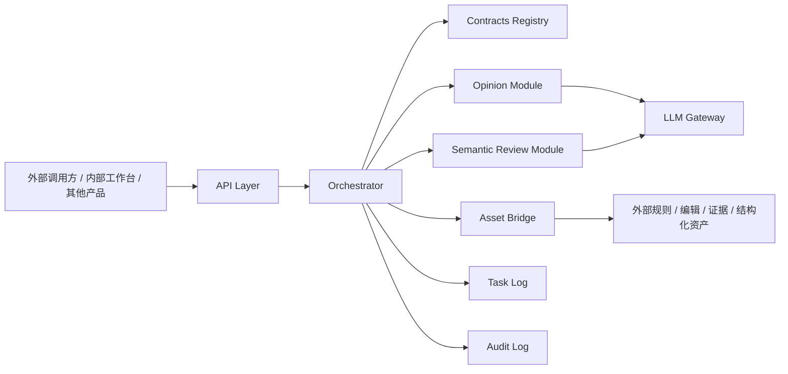

# 侠客岛系统设计图纸

> **日期**: 2026-03-13
> **版本**: v0.6
> **性质**: 项目总纲 / 已评审
> **当前状态**: 部分施工，核心目录与首批模块初版已存在；文档已评审，可作为后续对齐基线
> **适用目录**: `D:\汇度编辑部1\侠客岛`
> **命名说明**: 文件名日期与文档头部日期保持一致，当前统一为 `20260313`

---

## 文档治理与配套文档

### 变更日志

| 日期 | 版本 | 变更摘要 | 变更责任 |
|------|------|----------|----------|
| 2026-03-14 | v0.6 | 同步仓库现状为“部分施工”，并补充 `runtime_logging` 与 `Task Log / Audit Log` 的术语映射 | 当前草案整理 |
| 2026-03-13 | v0.5 | 根据复核结果收口治理状态，并明确评审证据统一由评审记录承接 | 当前草案整理 |
| 2026-03-13 | v0.4-draft | 将文档收缩为原则级总纲，拆出施工图纸与评审记录 | 当前草案整理 |
| 2026-03-13 | v0.3-draft | 补充架构阶段映射、Registry 分层说明、命名约定、技术风险、运行环境与鉴权立场，并清理对话残留 | 当前草案整理 |
| 2026-03-13 | v0.2-draft | 将文档重写为独立项目总纲，补充术语解释、技术栈约束、contract 治理、失败模式与评审清单 | 当前草案整理 |
| 2026-03-12 | v0.1-draft | 创建首版设计图纸草案 | 当前草案整理 |

### 文档修改规则

本文件是 `侠客岛` 的总纲文件。对以下内容的修改，必须至少经过一次设计评审后再落盘：

- 项目定位
- 核心边界
- 首阶段范围
- 总体架构
- 与 `V2` 的关系
- 关键决策与取舍

在正式指定文档 owner 之前，默认规则为：

1. 允许补充澄清和纠错。
2. 不允许未经评审直接改写核心边界。
3. 任何结构性改动都必须更新变更日志。

### 术语约定

- `Opencode`：当前用于交互式运行 AI 任务、调用 skill 和驱动开发流程的工具环境。本文提到“去 Opencode 化”，指核心能力不再依赖该工具才能启动与运行。
- `contract`：模块之间输入、输出、错误、日志追踪等结构化约定，必须在代码与 schema 中落地，而不能只存在于 Markdown 描述里。
- `V2`：当前仍承担一般任务的既有写作系统。
- `runtime_logging`：代码层日志承载目录名；能力与产物层仍使用 `Task Log / Audit Log` 描述任务追踪与审计输出。

### 配套文档

本文件只承载原则级内容。配套文档分工如下：

- `D:\汇度编辑部1\侠客岛\docs\侠客岛首阶段施工图纸_20260313.md`
  作用：承接模块设计、接口草案、技术栈落地、运行策略、目录骨架与实施路线。
- `D:\汇度编辑部1\侠客岛\docs\侠客岛系统总纲评审记录_20260313.md`
  作用：承接评审结论、核验证据与本轮文档拆分说明。

---

## 1. 项目定义

`侠客岛` 是一个面向中文医疗内容生产的独立能力平台。

它的目标不是再做一条“只能整链跑通”的写作流水线，而是建设一套可组合、可审计、可单独调用的内容能力中心，让不同产品、不同工作流都可以按需调用模块能力。

项目的核心定位是：

**中文医疗内容的编排与能力平台。**

它既可以：

- 作为独立程序，直接提供 API
- 作为内部工作台，承接复杂内容任务
- 作为其他产品的后端能力层，被单独调用某个模块

它也可以在后续被嵌入其他产品中，例如文章系统、观点系统、审核系统或内容运营系统。

---

## 2. 项目定位

### 2.1 侠客岛要解决什么问题

中文医疗内容生产里，常见的问题不是“不会生成文字”，而是：

1. 观点形成、文章写作、语义审核、证据引用往往混在一条黑箱流程里，难以拆开复用。
2. 某个模块想被单独调用时，经常只能绕着整条流水线走，成本高、维护差。
3. 业务规则常常写在提示词或人工约定里，不在程序 contract 里，导致迁移、复核和审计困难。
4. 当多个产品都要用同一套内容能力时，容易出现重复建设、双版本规则、日志链路断裂。
5. 如果主编排器同时掌握所有模块的内部规则、模板、证据索引和资产清单，编排层本身会再次膨胀成新的“大超市”，最终把模块化重新吃回黑箱。

`侠客岛` 就是为了解决这些问题而设计的。

### 2.2 侠客岛不是什么

`侠客岛` 不是：

- 一个只给单个 AI 会话使用的 prompt 工程
- 一个只能靠 Opencode skill 才能运行的系统
- 一套只面向“整篇文章生成”的单入口流水线
- 一个从第一天就要全量替代所有旧系统的重写工程

### 2.3 产品级定位

从产品角度看，`侠客岛` 更接近：

**模块化内容能力底座 + 主编排器。**

它的价值在于：

- 把“观点”“审核”“写作”“查询”“编排”拆成稳定能力
- 允许单模块调用和多模块编排并存
- 让业务规则、模块边界和结果结构从对话逻辑里抽离出来
- 让主编排器只掌握能力目录，而不是掌握所有模块的内部资产清单

---

## 3. 目标用户与使用场景

### 3.1 目标用户

首批主要用户包括：

- 内容团队
- 医学编辑团队
- 内部产品或工具开发者
- 需要调用内容能力的其他程序

### 3.2 典型使用场景

#### 单模块场景

- 输入证据材料，只要形成一个医学观点
- 输入一篇中文医疗稿件，只做语义审核
- 输入一份观点结果，只做后续写作

#### 工作流场景

- 先形成观点，再写成观点社论稿
- 先审核稿件，再给出定向改写目标
- 在同一条任务链里完成查询、观点、写作、审核的多步编排

#### 平台集成场景

- 侠客岛作为后台服务，被其他产品通过 API 调用
- 某个内容系统只调用 `opinion` 模块
- 某个发布系统只调用 `semantic_review` 模块

---

## 4. 项目目标

### 4.1 总目标

建设一个可独立运行的中文医疗内容能力平台，使其满足以下四个条件：

1. 模块能力可单独调用
2. 模块能力可被主编排器串联
3. 输入输出 contract 清晰、版本化、可测试
4. 能对外暴露统一 API，而不依赖 Opencode 才能启动

### 4.2 首阶段目标

首阶段不追求全功能，而追求“把第一批模块真正产品化”。

首阶段目标是：

1. 建立主编排器框架
2. 产品化 `医学观点产出`
3. 产品化 `中文语义审核`
4. 建立统一 contract 注册与校验机制
5. 建立与现有内容资产的桥接层
6. 提供单模块 API 与最小工作流能力基础

当前仓库现状补充：

- 首批目录骨架已经存在
- `opinion`、`semantic_review`、`orchestrator` 与 `runtime_logging` 已有初版代码实现
- 因此首阶段当前重点是对齐、收口和补强，而不是从零开始搭骨架

### 4.3 成功标准

当以下条件成立时，说明 `侠客岛` 首阶段设计是正确的：

1. 外部程序能不经 Opencode 直接调用能力接口
2. 同一个模块既能单跑，也能被工作流调用
3. 规则与结构不再主要寄存在 skill 文档中
4. 结果结构可被下游程序稳定消费
5. 过渡期内不破坏现有运行系统

---

## 5. 功能边界

### 5.1 首阶段纳入范围

首阶段在原则上聚焦以下几类能力：

- 主编排器能力
- `opinion` 模块
- `semantic_review` 模块
- contract 管理与校验能力
- 资产桥接能力
- 对外 API 能力
- 调用日志与审计能力

### 5.2 后续扩展范围

后续可以逐步纳入：

- `writing` 模块
- `query` 模块
- `router / intent` 模块
- `workflow composer / team recipes`
- 前端工作台
- 策略配置台

补充约束：

- `Agent Teams` 只作为 `Orchestrator` 上的可选编排模式，不作为首阶段基础架构。
- 自由对话式多 agent 协商不作为核心运行机制；跨节点传递必须走 contract 校验与 task log。

### 5.3 当前明确不做

当前总纲阶段不做：

- 全量替代现有系统
- 一上来拆成多服务分布式架构
- 把所有旧资产复制到新项目里双写
- 提前承诺生产可用

---

## 6. 原则级技术与运行约束

### 6.1 可复用性

- 每个模块都必须支持独立调用
- 每个模块的输入输出必须标准化

### 6.2 可编排性

- 主编排器必须能够在模块之间安全传递 payload
- 工作流模式不能破坏单模块模式
- 主编排器只基于能力级元数据、contract 和状态做选仓与编排，不维护模块内部全量 inventory
- 模块内部规则、模板、证据索引与资产清单由各模块 owner 自行维护，并通过稳定 contract 暴露必要能力

### 6.3 可审计性

- 每次调用都应生成可追踪的任务记录
- 模块输入、输出、错误与版本信息应可回查

### 6.4 可迁移性

- 首阶段允许桥接旧资产
- 桥接层应隔离旧目录结构，不把旧系统耦合带进核心域层

### 6.5 可演进性

- 首阶段先做模块化单体
- 后续如确有必要，可将高价值模块拆成独立服务

### 6.6 模块粒度

- 不是所有预设能力名称都应立即升级为独立模块
- 只有同时满足“可单独调用、输入输出可稳定 schema 化、被多个工作流复用、需要独立日志与 owner”的能力，才应升级为正式模块
- 尚未满足这些条件的能力，应优先作为现有模块内部能力、`workflow composer / team recipes` 配方或 adapter 内部实现存在
- 主编排器面向的是模块能力目录，不是模块内部 inventory；inventory 膨胀不能反向污染编排层

### 6.6 技术原则

- 首阶段只使用一套主语言与主运行时，不做多语言混编
- schema、API、测试三者必须共享同一结构定义来源
- 具体框架、具体版本、具体鉴权与部署策略，不在总纲锁死，而由施工图纸与 ADR 承接

### 6.7 运行原则

- 首阶段默认先满足本地可启动、可调用、可记录日志
- 生产级部署、复杂网络边界与高可用策略不在总纲层详述
- 安全能力采用渐进增强，不以“暂不生产化”为借口忽略最小边界控制

---

## 7. 侠客岛与 V2 的关系

这部分只解释边界，不定义 `侠客岛` 本身。

### 7.1 `V2` 是什么

`V2` 是当前仍在承担一般任务的现有运行系统。

它已经有独立 `engine` 和主链入口，适合继续承担：

- 一般写作任务
- 当前运行链路
- 现有知识与规则资产的承载

### 7.2 `侠客岛` 是什么

`侠客岛` 是独立新项目，不是 `V2` 的目录镜像，也不是单纯备份仓。

它的职责是：

- 建立新的模块能力平台
- 承接去 Opencode 化的模块产品化
- 为未来的外部调用和多产品复用提供统一架构

### 7.3 两者如何共存

过渡期建议采用：

- `V2` 继续运行
- `侠客岛` 独立设计、独立施工
- `侠客岛` 通过桥接层只读复用 `V2` 的部分资产

### 7.4 两者边界

边界应写死为：

- `V2` 不是 `侠客岛` 的施工目录
- `侠客岛` 不是 `V2` 的第二运行副本
- 同一项策略、contract 或模块规则不能在两边并行双写为真相源
- 如某项能力正式迁入 `侠客岛`，必须明确唯一真相源归属

能力迁入的最小流程建议写死为：

1. 在 `侠客岛` 文档中声明迁入对象与目标 owner。
2. 明确标记原系统中该能力的状态：继续兼容、只读引用或停止演进。
3. 更新 bridge 或调用关系，使消费者明确读取哪一侧。
4. 记录一次迁入确认，说明自何时起以哪一侧为唯一真相源。

---

## 8. 高层架构

### 8.1 架构原则

- API 层只负责接入，不承载业务规则
- Orchestrator 只负责编排，不承载模块内部策略
- Orchestrator 只根据 capability metadata、contract 兼容性和任务状态决策，不直接持有模块内部货物清单
- `Agent Teams / team recipes` 如需引入，只能位于编排层，不能取代模块边界与 contract
- 模块负责各自业务逻辑
- 模块 owner 负责本模块 inventory、规则细节和资产演进
- Bridge 负责资产接入，不负责业务判断
- Contracts Registry 负责结构边界，不负责生成逻辑

---

## 9. 关键决策与取舍

### 决策 1：先做模块化单体，不先做多服务

原因：

- 当前目标是建立清晰模块边界，而不是解决分布式扩展
- 过早拆服务会把复杂度提前转移到网络与部署层

代价：

- 首阶段服务隔离感不如天然微服务强

收益：

- 更稳
- 更快
- 更容易审查 contract

### 决策 2：先做 `opinion + semantic_review`

原因：

- 这两个模块最符合“可单独调用 + 可被编排”
- 观点形成和中文审核都是高价值独立能力

代价：

- 首阶段无法覆盖完整写作闭环

收益：

- 更适合作为平台能力样板

### 决策 3：通过 Bridge 读取现有资产，不整库复制

原因：

- 减少双份资产与双真相源
- 降低迁移期混乱

代价：

- 初期会存在对外部资产入口的桥接依赖

收益：

- 更适合稳态迁移

---

## 10. 风险与缓解

### 风险 1：项目定义漂移

表现：

- `侠客岛` 一会儿被当成独立平台，一会儿又被当成 `V2` 影子工程

缓解：

- 先写 README 和 ADR
- 每次新增模块时都回指本总纲

### 风险 2：contract 继续散落在文档里

表现：

- 设计写得清楚，但代码没有统一 schema

缓解：

- 首批就建立 `contracts` 目录和测试

### 风险 3：双真相源

表现：

- 同一策略在 `V2` 和 `侠客岛` 两边都改

缓解：

- 任何迁入模块都必须明确唯一真相源归属

### 风险 4：过早扩 scope

表现：

- 还没跑稳 `opinion` 和 `semantic_review`，就想一并迁移全写作链

缓解：

- 首阶段只允许围绕首批模块施工

### 风险 5：LLM 输出结构不稳定

表现：

- 模型返回内容可能不稳定，导致输出不满足 contract schema 或字段语义漂移

缓解：

- 对模块输出做统一 schema 校验
- 将 prompt 与模型参数版本化
- 失败时返回结构化错误，而不是放行不合格结果

### 风险 6：Bridge 对外部资产入口的依赖失效

表现：

- 若外部资产结构变化，Bridge 可能读取失败或出现错误映射

缓解：

- 在 Bridge 层集中管理资产入口映射
- 启动时做可达性检查
- 读取失败时显式报错，不允许静默降级

### 风险 7：单体服务的并发与资源上限不明

表现：

- 多调用方并发访问时，首阶段单体服务可能出现吞吐瓶颈、超时或资源竞争

缓解：

- 首阶段先记录调用耗时和失败率
- 不承诺生产级并发能力
- 待真实负载出现后，再决定是否进入独立部署、队列化或服务拆分

---

## 11. 设计评审检查清单

无论由人还是 AI 评审，建议优先检查下面 6 个问题：

1. `侠客岛` 作为独立项目的定位是否已经清楚，而不是只依赖上下文对话成立。
2. “模块化能力平台 + 主编排器”是否是比继续扩流水线更合理的长期方向。
3. 首阶段先做 `opinion + semantic_review` 是否足够聚焦。
4. `侠客岛` 与 `V2` 的边界是否写得足够清楚，且不会制造双真相源。
5. 当前高层模块图是否足以支撑后续 README、ADR 和施工图纸。
6. 是否还缺一个必须在施工前先写死的关键约束。

---

## 12. 建议结论

`侠客岛` 应被定义为：

**一个独立的中文医疗内容能力平台，以主编排器为中心，逐步沉淀可独立调用、可编排、可对外提供 API 的内容模块。**

其首阶段目标是：

**优先把“医学观点产出”和“中文语义审核”做成真正的产品化模块。**
