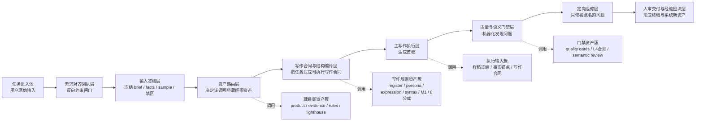
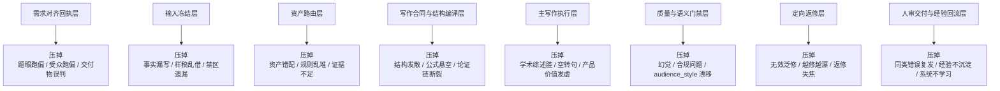

# 藏经阁III期实验架构总图_20260407

状态：III期方法母图 / 待执行  
日期：2026-04-07  
用途：把“侠客岛理想写作系统”压成一张可执行的宏观建设总图，作为 `III期` 的方法母文档；后续 `III期` 测试、裁决、补强，都以这份总图为总口径  
定位：这不是工程说明书，不是实验结论，也不是 prompt 清单；它是一张“节点图 + 约束杠杆图 + 风险压制图”

## 证据摘要

1. 已直接核对 [本地Agent写作系统手册.md](D:/汇度编辑部1/项目文章/本地Agent写作系统手册.md)、[workflow.py](D:/汇度编辑部1/侠客岛/src/api/routes/workflow.py)、[writing.py](D:/汇度编辑部1/侠客岛/src/api/routes/writing.py)、[quality.py](D:/汇度编辑部1/侠客岛/src/api/routes/quality.py)、[semantic_review.py](D:/汇度编辑部1/侠客岛/src/api/routes/semantic_review.py) 与 [runtime_assets.py](D:/汇度编辑部1/侠客岛/src/runtime_assets.py)，确认当前系统真实存在：`asset-catalog / standard-chain / writing_trace / quality / semantic review` 这条正式链，以及 `product manifest / evidence / rule packs / style lighthouses / register / persona / expression / native syntax / M1` 这类藏经阁资产入口。
2. 已直接核对 [IIF_系统上限结论.md](D:/汇度编辑部1/侠客岛/docs/多Agent藏经阁实验/8条公式总实验目录/02_阶段实验结果/II期/IIF成果整理/IIF_系统上限结论.md)，确认当前系统上限停在“有价值底稿”，主要瓶颈集中在 `audience_style`、`key_facts`、`hallucination_control`，这决定了 `III期` 不能只测“会不会写”，而要测“约束杠杆能不能先压掉这些风险”。
3. 已直接核对 [01_仑卡奈单抗突触保护_语料匹配.md](D:/汇度编辑部1/项目文章/2026项目表/00_侠客岛现有成果接入包/10_实战经验归档/01_仑卡奈单抗突触保护_语料匹配.md)、[08_冷启动Agent通用接手配置.md](D:/汇度编辑部1/项目文章/2026项目表/00_侠客岛现有成果接入包/08_冷启动Agent通用接手配置.md) 与 [09_稿件类型要求总表.md](D:/汇度编辑部1/项目文章/2026项目表/00_侠客岛现有成果接入包/09_稿件类型要求总表.md)，确认“需求对齐回执层”已经不是口头想法，而是已落地的高优先级硬闸门口径，且最新接入逻辑已改成：`用户给真实写作场景 -> 系统内部判一级稿型 -> 主二级稿型 -> 主样稿母本`。

## 一句话总定位

`侠客岛理想写作系统 = 上游反向冻结约束 + 中游正向写作约束 + 下游门禁返修约束 的接力系统。`

这里最关键的变化不是“再堆更多公式”，而是把系统从单一正向推演，改成：

`先缩任务空间，再编译写作空间，最后做门禁纠偏。`

---

## 一、为什么按这些节点拆

这份总图不按技术模块拆，也不按接口文件拆。  
它按“约束接力点”拆。

一个节点只有同时满足下面 `3` 条，才值得在总图里单独出现：

1. 它接收一类独立输入。
2. 它产出一个下游要反复引用的稳定结果。
3. 它能明显压掉一类核心风险。

所以这里的节点，不是 `workflow.py / quality.py / semantic_review.py` 这种工程节点，  
而是写作系统里的高杠杆节点。

### 4. 节点图不是终点，III期必须补接口路由图

这份总图把“点”先压出来了，但 `III期` 真正要走到成稿级，不能只停在节点图。  
每个关键节点之间，都必须再补一条**接口路由**。

这里的“接口路由”不是泛泛调度，而是每条边都要明确回答：

1. 上一个节点到底交来了什么输入
2. 这一跳到底判断什么
3. 可能分出哪几条路
4. 哪条路交给下游什么稳定结果

所以 `III期` 后续不只要测“节点有没有用”，还要测“节点之间的路由判定稳不稳”。  
当前优先级最高的第一条路由是：

- `需求对齐回执层 -> 输入冻结层`

因为它决定后面所有冻结、取材、样稿借用和写稿，是不是在同一个任务理解上继续推进。

---

## 二、III期主链总图

---

## 三、节点总表：谁输入、谁执行、压什么风险

| 节点 | 谁输入 | 输入是什么 | 谁执行 | 主要调用的藏经阁资产 | 输出是什么 | 约束杠杆 | 主要压掉的风险 |
| --- | --- | --- | --- | --- | --- | --- | --- |
| 任务进入池 | 用户 | 对话框里的任务描述、附件、样稿、修改意见、配图 | 当前接手 Agent | 暂不调用正式资产，先全量接收 | 一份未切碎的原始任务包 | 输入完整性杠杆 | 材料丢失、输入碎片化、把“没建目录”当阻塞 |
| 需求对齐回执层 | 当前接手 Agent 基于原始任务包回显理解 | 任务包 + 当前理解 | 冷启动 Agent 或当前主 Agent | 写作场景路由表、真实终稿语料、改稿硬规则 | 一份极短需求对齐回执 | 反向约束杠杆 | 场景误判、题眼跑偏、受众跑偏、交付物误判、产品口径跑偏 |
| 输入冻结层 | 原始任务包 | brief、原始资料、样稿、禁区 | 冷启动整理 Agent | brief 冻结模板、事实锚点模板、样稿冻结模板、禁区卡、写作合同卡 | `A-E` 五个冻结文件 | 冻结杠杆 | 事实漏写、样稿乱借、禁区遗漏、后续 revise 无靶点 |
| 资产路由层 | 输入冻结层 | 已冻结的任务输入 | planning / routing 层 | `product manifests`、`evidence entries`、`rule packs`、`style lighthouses` | 一次任务级资产组合 | 资产选择杠杆 | 资产错配、证据不足、风格资产乱用、无效堆料 |
| 写作合同与结构编译层 | 资产路由层 | 冻结输入 + 资产组合 | writing / planning 编译层 | `register_levels`、`persona_kernels`、`expression_base`、`native_syntax_rules`、`m1_argument_logic_rules`、`8公式` | 可执行写作合同、结构骨架、主证据链顺序 | 正向编译杠杆 | 结构发散、公式不落地、目的与段落推进脱节 |
| 主写作执行层 | 写作合同层 | 合同、证据、样稿借用范围、风格约束 | drafting / 主写作 Agent | 样稿冻结结果、证据锚点、`8公式`、persona / register 资产 | 首稿 | 文本生成杠杆 | 学术综述腔、空转句、产品价值发虚、关键事实打不进去 |
| 质量与语义门禁层 | 主写作执行层 | 首稿 | quality + semantic review | `quality gates`、`L4` 合规资产、语义审校规则 | 问题单、严重度、`rerun_scope`、`rewrite_target` | 门禁杠杆 | 幻觉、禁区踩线、结构缺口、受众语气漂移 |
| 定向返修层 | 门禁层 | 问题单 + 首稿 + 原写作合同 | revise Agent | rewrite target、问题类型修复规则、原冻结输入 | 修订稿或平台化结论 | 定向修复杠杆 | 无效泛修、越修越漂、自评抖动、无意义循环 |
| 人审交付与经验回流层 | 修订稿 + 问题单 | 修订稿、编辑判断、客户反馈 | 编辑 / 你 | 真实终稿、退稿点、客户反馈、法务要求 | 终稿 + 新语料 / 新规则 / 新硬闸门 | 经验回流杠杆 | 同类错误反复发生、实验不沉淀、系统学不会真实终稿偏好 |

### 人审交付与经验回流层的统一接入口径

这里最容易失控的，不是“有没有经验”，而是不同层的东西被混着写，最后变成多处各有一套口径。

以后凡是进入系统的内容，必须先分清 `3` 层，禁止混写：

1. `原始证据层`
   - 真实终稿、退稿点、客户反馈、用户明确纠偏、门禁问题单、直接核对到的稿面现象
2. `经验归纳层`
   - 你的经验、单篇复盘、AI 对改稿的总结、局部方法判断
3. `正式系统口径层`
   - 已冻结到节点、路由、写作合同、门禁检查项、资产规则里的正式说法

这 `3` 层的关系不是并列投票，而是固定顺序：

1. 先看 `原始证据层`，不允许拿 AI 总结或一句复盘替代真实稿面与真实反馈
2. 再把 `经验归纳层` 压成最小抽象，只允许保留 `1` 条主判断，不得顺手膨胀成一串平行规则
3. 再把这条主判断映射到现有节点，明确它到底属于：
   - `需求对齐回执层`
   - `输入冻结层`
   - `资产路由层`
   - `写作合同与结构编译层`
   - `质量与语义门禁层`
   - `定向返修层`
   - `人审交付与经验回流层`
4. 映射完成后，只允许 `4` 种处置：
   - `保留旧口径`
   - `收紧旧口径`
   - `挪到正确节点`
   - `删除补过头内容`
5. 只有现有节点和现有载体都明确接不住时，才允许新增；新增前必须先写清“为什么旧口径接不住”

这里要写死一条 `III期` 接入口径：

- 你的经验、AI 总结、局部复盘，都不是正式口径本身
- 它们只能作为候选输入，先经过“证据回看 -> 最小抽象 -> 节点映射 -> 处置裁决”这条链
- 一旦正式吸收，必须指定 `1` 个唯一真相源；其余文件只做引用、摘要或回指，不再各写一版

因此，人审交付与经验回流层真正要产出的，不只是“又多了一条经验”，而是：

1. 这条经验的原始证据是什么
2. 它的最小抽象是什么
3. 它属于哪个现有节点
4. 最终处置是保留、收紧、挪位、删除，还是在极少数情况下新增

没有这 `4` 步，就只算“有了新总结”，不算“系统已经吸收”。

这里还要明确：

- 案例不是封闭清单
- 清单也不是先天完整
- 更合理的关系是：先持续积案例，再从案例里反抽当前可执行清单

所以后续每出现一个新案例，默认动作不是“先加一条新规则”，而是：

1. 先补原始证据
2. 再补最小抽象
3. 再看它是落进旧案例，还是暴露了一个新边界
4. 最后才决定要不要改当前清单

也就是说，清单是阶段性操作面，案例才是持续扩展面。

### III期下一层建设：把关键边补成接口路由

主链已经拆出节点，但 `III期` 后续正式设计应把下面 `5` 条边补成单独路由文件：

1. `需求对齐回执层 -> 输入冻结层`
2. `输入冻结层 -> 资产路由层`
3. `资产路由层 -> 写作合同与结构编译层`
4. `主写作执行层 -> 质量与语义门禁层`
5. `质量与语义门禁层 -> 定向返修层 / 回上游重冻`

其中第一条路由是当前最高优先级，因为它负责判断：  
这次任务的稿件类型、交付物、受众、主角度、主证据链、必写点和禁区，是否已经稳定到足以进入冻结阶段。

---

## 四、哪几个节点才是高杠杆节点

不是每个节点的杠杆级别都一样。  
`III期` 最该测的，不是“整条链有没有跑起来”，而是下面 `4` 个高杠杆节点到底能不能稳稳压住风险。

### 1. 需求对齐回执层

这是新增的最高优先级节点。  
它不是礼貌确认，也不是多一道废话。

它真正干的事，是在动笔前先冻结：

- 这次处在哪个真实写作场景
- 系统内部对应哪种一级稿型
- 主二级稿型到底是哪一条
- 对应绑定哪一种样稿母本
- 真正交付物是什么
- 写给谁
- 主角度是什么
- 必写点和禁区是什么

如果这层不稳，后面所有“公式”“样稿”“revise”都可能是在错方向上写得更认真。

这里要特别强调：

- 输入可以是随机的、散的、口语的
- 但输出不能散

这里要新增一条 `III期` 正式口径：

- 输入不能限死
- 输出必须定死

也就是说，用户不需要先学会“稿型”这个内部分类，只需要给出真实场景、材料和目标。  
需求对齐层必须自己把随机输入压成固定输出：

`真实写作场景 -> 一级稿型 -> 主二级稿型 -> 主样稿母本`

所以需求对齐层不是只给一个名字，而是同时给后续执行链一条固定路由和一条固定样稿路线。

### 当前已冻结的场景入口

当前 `III期` 先按下面 `8` 个真实写作场景做上游入口：

1. 新研究 / 新文献出来了，要写透
2. 大会热点结果出来了，要抢时效和判断
3. 产品新获批 / 新适应症 / 新中国数据出来了
4. 要讲清某个产品 / 路线的核心机制，或两个机制 / 两条路线的关键差异
5. 病种 / 赛道 / 治疗框架变了，要重画地图
6. 要讲公司、管线、布局、战略位置
7. 患者 / 家属最关心怎么选、有什么区别、副作用怎么办
8. 监管审评分歧、替代终点争议、方法论问题要讲清规则和判断

这些场景不是让用户填表，  
而是要求系统在回执层先把任务压到这组有限入口里，再向下游放行。

当前 `III期` 已冻结的分级稿型口径是：

1. `研究解读类`
   - 研究/文献深度解读
   - 领域新进展解读
   - 监管/方法论争议解读
   - 沸点争鸣
2. `机制解读类`
   - 单产品机制深挖
   - 双路线机制差异
3. `领域与产业叙事类`
   - 领域格局分析
   - 产业故事
   - 药物/靶点发展史
4. `患者沟通类`
   - 患者向-治疗选择
   - 患者向-AE与管理
   - 患者向-疾病认知翻译

### 2. 输入冻结层

这层负责把“散材料”压成“可重复引用的稳定输入”。  
它是主链能不能稳写 `key_facts` 的前提。

如果没有这层，主写作 Agent 往往会在：

- 一堆 PDF 里随手取材
- 样稿借用边界不清
- 禁区只记住一半
- revise 时找不到原锚点

### 3. 写作合同与结构编译层

`8公式` 的主战场不在全系统，而主要在这里。  
它的作用不是直接替你写稿，而是把任务压成：

- 为什么写
- 写到哪里
- 该怎样推进
- 该怎样收口

所以 `8公式` 更像中游的正向骨架，而不是最上游的总开关。

### 4. 质量与语义门禁 + 定向返修层

这两层只有在前面已经冻结住任务时，才真正有价值。  
如果上游没冻结，revise 往往只是：

- 修掉一个问题，再长出另一个问题
- 分数波动，但没有稳定正增益
- 看起来很忙，实际上没有同一目标

---

## 五、约束杠杆图：每个节点在压什么风险

---

## 六、当前现实与理想架构的差距

| 节点 | 理想状态 | 当前现实 | 当前主要缺口 |
| --- | --- | --- | --- |
| 需求对齐回执层 | 成为所有写作任务的系统级硬闸门 | 已在接入包和任务卡里落地，但还未经过正式阶段实验裁决 | 还没通过 `III期` 正式证明它能稳定提分 |
| 输入冻结层 | 成为所有真实任务的标准前置层 | 已有 `A-E` 冻结文件体系 | 还未证明它能显著抬高 `key_facts / hallucination_control` |
| 资产路由层 | 能根据任务自动选对资产，而不是全塞 | 系统里已有 `asset-catalog / standard-chain` | 任务与资产的映射策略仍不够稳、不够解释化 |
| 写作合同与结构编译层 | 8公式成为中游稳定骨架 | 当前公式因果性未证成，但公式位与规则资产已存在 | 公式落地率和表达线还不稳 |
| 主写作执行层 | 稳定打到“可交付草稿” | 当前实测上限是“有价值底稿” | `audience_style` 和中段推进感仍是硬伤 |
| 门禁与返修层 | 问题发现稳定、定向修复有效 | quality / semantic review 已成型 | revise 还没被证明有稳定正增益 |
| 人审与回流层 | 真实终稿偏好能稳定回流系统 | 已有实战语料匹配开始补回流 | 还没形成正式的“回流 -> 再实验 -> 再收口”制度化闭环 |

---

## 七、III期真正要测什么

`III期` 不应该再只问一句：“8公式到底有没有用？”

`III期` 更准确的测试目标应该是：  
**这些约束节点按顺序接起来后，系统上限能不能被明显抬高。**

建议 `III期` 直接围绕下面 `4` 个假设做：

### 假设 1：需求对齐回执层是更高杠杆的上游约束

要测：

- 加上回执层后，`route_alignment` 是否显著改善
- `audience_style` 是否更稳
- 返修轮次是否减少

### 假设 2：输入冻结层能显著提升事实稳定度

要测：

- `key_facts` 是否明显提升
- `hallucination_control` 是否更稳
- revise 是否更少出现“修一处坏一处”

### 假设 3：8公式只有嵌进“写作合同与结构编译层”才可能真正有效

要测：

- 公式是否能稳定落到结构推进、中段展开、收尾回收
- `formula_compliance` 与真实分数是否开始出现更强相关

### 假设 4：revise 的前提不是“多修几轮”，而是“上游先冻结住目标”

要测：

- 同样的 revise，在“无回执 / 无冻结输入”和“有回执 / 有冻结输入”两种条件下，效果是否显著不同

---

## 八、对 III 期最重要的总判断

`III期` 的建设重点，不应再理解成“继续加更多正向公式”。  
更准确的建设逻辑应该是：

1. 先用 `需求对齐回执层` 压缩任务空间；
2. 再用 `输入冻结层` 稳住事实、样稿、禁区；
3. 再让 `8公式` 在中游承担结构编译与写作推进；
4. 最后用 `质量 / 语义 / 定向返修` 做下游纠偏。

一句话说透：

`III期` 不是给 `8公式` 多加几条说明，而是把“回执层 + 冻结层 + 8公式层 + 门禁返修层”，以及它们之间的接口路由，真正接成一个系统。

---

## 九、补充：当前源码口径下可直接识别的资产簇

这部分只做补充，不抢主图。

### 1. 路由与编排侧

- `asset-catalog`
- `standard-chain`
- `writing_trace`
- `quality/review`
- `review/semantic`

### 2. 藏经阁资产侧

- `product manifests`
- `evidence entries / evidence facts`
- `rule packs`
- `style lighthouses`
- `register_levels`
- `persona_kernels`
- `expression_base`
- `native_syntax_rules`
- `m1_argument_logic_rules`

### 3. 这份总图里的资产使用原则

1. 不把所有资产一起塞进去。
2. 资产先服务“任务冻结”，再服务“写作执行”。
3. `8公式` 不是独立宇宙，它应与 `register / persona / style / evidence / sample` 一起在中游编译层协同工作。
