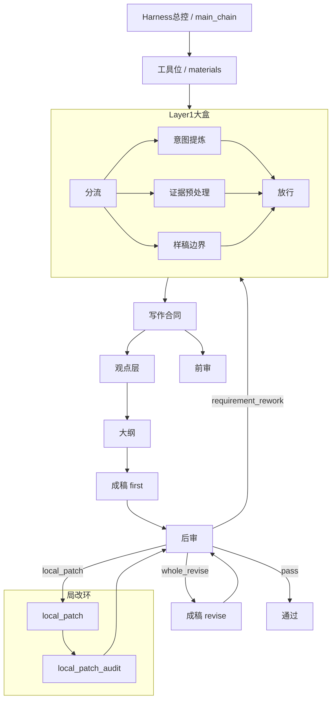
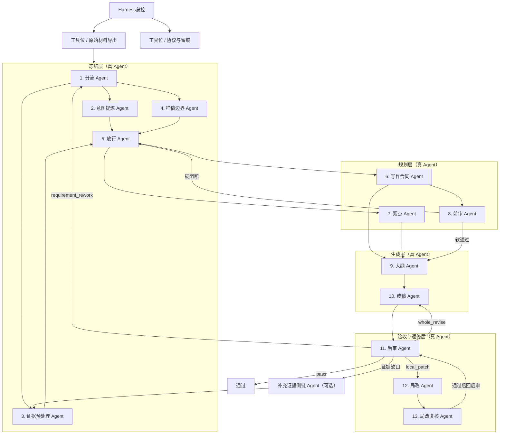

# 白盒系统冷启动施工手册（真实架构 + 理想架构）

- 日期：2026-04-15
- 状态：已按当前代码核对，可作为冷启动 Agent 的阅读与施工底稿；首次接棒前仍应对目标节点再开一次脚本核对
- 范围：只写当前白盒主链、当前返修链、当前接入素材与理想 Harness 目标，不展开历史废链
- 用途：让一个完全冷启动的 Agent 读完后，能知道系统现在怎么跑、每个节点吃什么吐什么、哪些是工具位、哪些是真 Agent 位、下一步应该从哪里开工

## 这份文档解决什么

一句话：这不是“漂亮架构图”，而是一份可作为接棒施工底稿的系统说明书。

它必须同时回答 4 件事：

1. 系统现在真实长什么样。
2. 每个节点到底负责什么、接什么素材、产什么东西。
3. 当前实现和理想 Harness 形态之间还差什么。
4. 冷启动 Agent 下一步应该读什么、改什么、怎么验。

## 使用边界

这份文档解决的是“结构看懂”和“施工入口清楚”，不等于替代节点级代码核对。

冷启动 Agent 正确使用方式是：

1. 先用本文件建立全局图。
2. 再打开你要动的那个节点脚本、prompt、profile、protocol。
3. 改完后仍然要做静态校验；环境齐备时要做最小 live run。

## 证据摘要

1. [run_whitebox_main_chain.ps1](../../../../侠客岛白盒编排器/run_whitebox_main_chain.ps1) 直接写明当前主链是 `materials -> layer1 -> writing_contract -> viewpoint -> outline -> draft(first) -> post_review -> three_flow_loop`；`STEP 2.5` 还证明 `pre_review` 是合同后启动的并行 job，不是首稿前的硬串行闸门。
2. [run_whitebox_outline.ps1](../../../../侠客岛白盒编排器/run_whitebox_outline.ps1) 与 [config/node_io_protocol.json](../../../../侠客岛白盒编排器/config/node_io_protocol.json) 直接证明：`viewpoint_card` 是大纲正式输入；缺失时只能显式退化，不能静默吞空。
3. [run_whitebox_draft_node.ps1](../../../../侠客岛白盒编排器/run_whitebox_draft_node.ps1) 直接证明 `draft` 是一个 Agent 两种 mode；[whitebox_common.ps1](../../../../侠客岛白盒编排器/whitebox_common.ps1) 直接证明它会挂 L1/L2/L3 藏经阁资产，而不是裸吃大纲和证据。
4. [run_whitebox_post_review.ps1](../../../../侠客岛白盒编排器/run_whitebox_post_review.ps1) 与 [run_whitebox_local_patch_loop.ps1](../../../../侠客岛白盒编排器/run_whitebox_local_patch_loop.ps1) 直接证明：后审是三流裁决口，`local_patch` 是一个修稿 + 验收的小闭环。
5. [run_whitebox_supplementary_evidence.ps1](../../../../侠客岛白盒编排器/run_whitebox_supplementary_evidence.ps1) 直接证明：补证据侧链已经有独立脚本，但当前不进默认主链，且不得回填污染主证据包。

## 先记住 6 个术语

| 术语 | 人话解释 | 在本系统里怎么用 |
| --- | --- | --- |
| Harness | 总调度台 | 只负责编排、跳转、回流、留痕，不亲自写内容 |
| 工具位 | 干搬运和落盘的工位 | 例如 `materials`，负责导出 full text，不负责判断 |
| 真 Agent | 能单独接活、单独交活、单独返工的岗位 | 例如 `writing_contract`、`viewpoint`、`post_review` |
| 半 Agent | 有 prompt、有职责，但还包在大盒里 | 当前 `layer1` 里的几个子角色都属于这个状态 |
| mode | 同一个岗位的不同工作状态 | `draft` 的 `first` 和 `revise` |
| 侧链 | 不走默认主链，但可以在缺口时被拉进来 | `supplementary_evidence` |

## 白盒 / 灰盒 / 黑盒边界

| 层级 | 当前对象 | 说明 |
| --- | --- | --- |
| 白盒 | `main_chain`、`draft_node`、`post_review`、`local_patch_loop` | 脚本、输入、输出、回流关系都能直接读懂 |
| 灰盒 | `layer1` 大盒、`pre_review` 并行旁路 | 能跑，但角色边界还没有完全显式拆开 |
| 黑盒 | 外部 LLM 本身、PDF 抽取质量、未来可能接入的补证侧链 | 可调用，但内部推理不可控，或当前未纳入默认主链 |

## 系统定位

这套系统不是“一个 prompt 写完文章”，而是一个白盒写作流水线：

1. 先把原始材料抽成当前 run 可见的文本。
2. 先冻结意图、证据和样稿边界。
3. 再冻结写作合同和观点方向。
4. 再生成大纲、正文、后审。
5. 后审之后不止有一个“改稿”，而是三流回路。

最重要的现实约束有 2 条：

1. 主链正式输入只认原始材料，不认 `G0 证据卡`、`原始资料解读稿` 这类人工整理物。
2. 当前真实接法仍然是串行主链，不是理想中的全面并行多 Agent。

## 图 1：当前真实架构



### Mermaid 如果不渲染，就按这条 ASCII 读

```text
Harness(main_chain)
  -> materials
  -> layer1大盒
       -> 分流
       -> 意图提炼
       -> 证据预处理
       -> 样稿边界
       -> 放行
  -> writing_contract
  -> viewpoint
  -> outline
  -> draft(first)
  -> post_review
       -> pass
       -> requirement_rework -> 回 layer1
       -> whole_revise -> draft(revise) -> post_review
       -> local_patch -> local_patch_audit -> post_review

另有一条旁路：
writing_contract -> pre_review
pre_review 当前默认不拦主链，只做并行侧审预警
```

## 当前真实主链，按阶段读

### 阶段 0：materials 工具位

- 当前身份：工具位，不算内容 Agent。
- 脚本：[run_ii_whitebox_materials.ps1](../../../../侠客岛白盒编排器/run_ii_whitebox_materials.ps1)
- 真职责：把候选题 `input_rules` 指向的原始文件抽成当前 run 可用的文本。
- 当前吃什么：
  - 候选题的 `source_root`
  - 候选题的 `input_rules`
  - 允许抽取的原始 PDF / 文本材料
- 当前吐什么：
  - `materials/materials_compiled.txt`
  - `materials/materials_preview.txt`
  - `materials/materials_digest.md`
  - `materials/materials_manifest.json`
- 当前关键现实：
  - `materials_compiled.txt` 现在已经修成 full text，不再是过去那种前 `3000` 字预览。
  - `materials_preview.txt` 才是预览位。
  - 后续节点不该把预览误当正式材料。
- 当前禁止误解：
  - 这里不是“证据整理节点”，只是原始材料导出位。
  - 不能把 `G0 证据卡`、`原始资料解读稿` 当成它的正式输入。

### 阶段 1：layer1 大盒

- 当前身份：一个大盒，内部包了多个半 Agent。
- 脚本：[run_whitebox_layer1.ps1](../../../../侠客岛白盒编排器/run_whitebox_layer1.ps1)
- 当前真实目标：冻结 3 件事
  - 用户到底要什么
  - 当前原始材料里能确定什么
  - 样稿边界能不能借、哪些不能借
- 当前真实输入：
  - 用户输入
  - `materials_manifest` 指向的 full text 和 preview
  - 候选题上下文
- 当前真实输出：
  - `layer1/route_decision.json`
  - `layer1/sp_result.json`（仅 `route=sp`）
  - `layer1/intent_pack.json`
  - `layer1/evidence_pack.json`
  - `layer1/evidence_pack.md`
  - `layer1/sample_boundary.json`
  - `layer1/direct_resolution.json`（仅 `route=direct`）
  - `layer1/freeze_status.json`

#### layer1 当前执行顺序

1. `layer1_main` 先看 `用户输入 + 候选题上下文 + materials_manifest + 材料预览前 2000 字`，决定走 `direct` 还是 `sp`。
2. 如果走 `sp`，就跑 `layer1_sp`，产出 `sp_result.json`，并把 `freeze_status` 写成 `pending_sp`，主链在这一层停下。
3. 如果走 `direct`，就继续跑 3 个模块：
   - `intent_extraction`
   - `evidence_preprocessing`
   - `sample_boundary`
4. 3 个模块产物出来后，再交给 `layer1_direct` 做最终冻结裁定，决定能不能进入 `writing_contract`。

#### 1A. 分流 Agent 位

- 当前状态：半 Agent，包在 `layer1` 里。
- profile / prompt：
  - profile：`layer1_main`
  - prompt：[prompts/layer1_main.md](../../../../侠客岛白盒编排器/prompts/layer1_main.md)
- 作用：判断当前任务走直通还是走 SP。
- 产物：路由判定结果，决定后面是否能进冻结层。

#### 1B. 意图提炼 Agent 位

- 当前状态：半 Agent。
- profile / prompt：
  - profile：`intent_extraction`
  - prompt：[prompts/intent_extraction.md](../../../../侠客岛白盒编排器/prompts/intent_extraction.md)
- 主吃：
  - 用户输入
  - 候选题上下文
  - `materials_manifest` 概况
  - `materials_preview` 前 2000 字
- 主产：
  - `intent_pack.json`
- 它冻结的是：
  - 受众
  - 任务目标
  - 接受标准
  - 隐含要求

#### 1C. 证据预处理 Agent 位

- 当前状态：半 Agent。
- profile / prompt：
  - profile：`evidence_preprocessing`
  - prompt：[prompts/evidence_preprocessing.md](../../../../侠客岛白盒编排器/prompts/evidence_preprocessing.md)
- 主吃：
  - `materials` full text
  - 候选题上下文
- 主产：
  - `evidence_pack.json`
  - `evidence_pack.md`
- 当前现实：
  - JSON 版用于后续结构化冻结。
  - md 版用于下游写作顺读。

#### 1D. 样稿边界 Agent 位

- 当前状态：半 Agent。
- profile / prompt：
  - profile：`sample_boundary`
  - prompt：[prompts/sample_boundary.md](../../../../侠客岛白盒编排器/prompts/sample_boundary.md)
- 主吃：
  - 候选题配置里的样稿 / 参考答案路径
- 主产：
  - `sample_boundary.json`
- 它冻结的是：
  - 哪些可以借
  - 哪些一律不能借

#### 1E. 放行 Agent 位

- 当前状态：半 Agent。
- profiles / prompt：
  - profile：`layer1_direct`
  - prompt：[prompts/layer1_direct.md](../../../../侠客岛白盒编排器/prompts/layer1_direct.md)
  - 另有 `layer1_sp` 对应 SP 路径
- 主职：
  - 决定是否正式冻结，允许进入写作合同层
- 主产：
  - `freeze_status.json`

### 阶段 2：writing_contract

- 当前身份：接近真 Agent。
- 脚本：[run_whitebox_writing_contract.ps1](../../../../侠客岛白盒编排器/run_whitebox_writing_contract.ps1)
- profile / prompt：
  - profile：`writing_contract`
  - prompt：[prompts/writing_contract.md](../../../../侠客岛白盒编排器/prompts/writing_contract.md)
- 主吃：
  - `layer1/intent_pack.json`
  - `layer1/evidence_pack.json`
- 明确不吃：
  - `raw_materials`
  - `evidence_pack.md`
- 主产：
  - `writing_contract/writing_contract.json`
- 它冻结的是：
  - must include facts
  - 不允许越界的边界
  - 面向这篇稿子的写作承重要求

### 阶段 2.1：viewpoint

- 当前身份：接近真 Agent。
- 脚本：[run_whitebox_viewpoint.ps1](../../../../侠客岛白盒编排器/run_whitebox_viewpoint.ps1)
- profile / prompt：
  - profile：`viewpoint`
  - prompt：[prompts/viewpoint.md](../../../../侠客岛白盒编排器/prompts/viewpoint.md)
- 当前真实接法：
  - 串行接在 `writing_contract` 之后
  - 不是理想态的并行
- 主吃：
  - `layer1/freeze_status.json`
  - `layer1/intent_pack.json`
  - `layer1/evidence_pack.json`
- 明确不吃：
  - `raw_materials`
  - `evidence_pack.md`
  - `writing_contract.json`
- 主产：
  - `viewpoint/viewpoint_prompt.md`
  - `viewpoint/viewpoint_raw.txt`
  - `viewpoint/viewpoint_card.json`
  - `viewpoint/viewpoint_manifest.json`
- 它负责什么：
  - 把“这篇稿子到底站什么观点、怎么说、强调什么”收成一个可交接的观点卡
- 它不负责什么：
  - 不负责生成大纲
  - 不负责直接写正文

### 阶段 2.5：pre_review 并行旁路

- 当前身份：半真 Agent。
- 脚本：[run_whitebox_pre_review.ps1](../../../../侠客岛白盒编排器/run_whitebox_pre_review.ps1)
- profile / prompt：
  - profile：`pre_review`
  - prompt：[prompts/pre_review.md](../../../../侠客岛白盒编排器/prompts/pre_review.md)
- 当前真实接法：
  - 在合同后由 `main_chain` 启动并行 job
  - 当前默认不阻塞大纲和首稿
- 主吃：
  - `layer1/intent_pack.json`
  - `writing_contract/writing_contract.json`
  - `layer1/evidence_pack.json`
- 明确不吃：
  - `raw_materials`
  - `evidence_pack.md`
- 主产：
  - `pre_review/pre_review_result.json`
- 正确理解：
  - 它现在更像“开工前侧审预警”
  - 不是当前主链里的硬闸门

### 阶段 3：outline

- 当前身份：接近真 Agent。
- 脚本：[run_whitebox_outline.ps1](../../../../侠客岛白盒编排器/run_whitebox_outline.ps1)
- profile / prompt：
  - profile：`outline`
  - prompt：[prompts/outline.md](../../../../侠客岛白盒编排器/prompts/outline.md)
- 主吃：
  - `layer1/intent_pack.json`
  - `writing_contract/writing_contract.json`
  - `layer1/evidence_pack.json`
  - `viewpoint/viewpoint_card.json`
- 当前现实：
  - 如果 `viewpoint_card` 缺失，它不会假装一切正常，而是显式写退化状态。
- 主产：
  - `outline/outline_prompt.md`
  - `outline/outline_raw.txt`
  - `outline/outline.json`
  - `outline/outline.md`
- 它负责什么：
  - 把合同和观点收进一个可执行的大纲骨架
- 它不负责什么：
  - 不把自己写成“第二份观点卡”

### 阶段 4：draft Agent

- 当前身份：真 Agent 位，但有两个 mode。
- 脚本：[run_whitebox_draft_node.ps1](../../../../侠客岛白盒编排器/run_whitebox_draft_node.ps1)
- mode：
  - `first`
  - `revise`

#### 4A. 首稿模式 `first`

- profile / prompt：
  - profile：`draft_first`
  - prompt：[prompts/draft_first.md](../../../../侠客岛白盒编排器/prompts/draft_first.md)
- 主吃：
  - `outline/outline.json`
  - `layer1/evidence_pack.md`
  - `layer1/intent_pack.json`
- 自动挂载的素材：
  - L1 写作资产：`native_syntax_rules.json`
  - L2 医学资产：`medical_syntax_rules.json`
  - L2 表达资产：`medical_expression_profiles.json`
  - L3 疾病资产：匹配到的 `disease_knowledge.json`
  - L3 来源资产：匹配到的 `source_registry.json`
- 素材来源脚本：
  - [whitebox_common.ps1](../../../../侠客岛白盒编排器/whitebox_common.ps1) 里的 `Get-WhiteboxDraftAssetBundle`
- 主产：
  - `draft/draft.txt`
  - `draft/draft_first_raw.txt`
  - `draft/draft_manifest.json`
- 正确理解：
  - 这是“按大纲成稿”
  - 不是任意自由写作

#### 4B. 全文整改模式 `revise`

- profile / prompt：
  - profile：`draft_revise`
  - prompt：[prompts/draft_revise.md](../../../../侠客岛白盒编排器/prompts/draft_revise.md)
- 主吃：
  - `draft/draft.txt`
  - `post_review/revise_card.json`
  - `outline/outline.json`
  - `layer1/evidence_pack.md`
- 自动挂载的素材：
  - 与首稿模式同源，仍然走 `Get-WhiteboxDraftAssetBundle`
- 主产：
  - 覆盖后的 `draft/draft.txt`
  - `draft/draft_revise_raw.txt`
  - `draft/draft_manifest.json`
- 正确理解：
  - 这是同一个 `draft Agent` 的另一种工作状态
  - 不是另起一个完全独立的岗位

### 阶段 5：post_review

- 当前身份：真 Agent 位，还是三流裁决口。
- 脚本：[run_whitebox_post_review.ps1](../../../../侠客岛白盒编排器/run_whitebox_post_review.ps1)
- profile / prompt：
  - profile：`post_review`
  - prompt：[prompts/post_review.md](../../../../侠客岛白盒编排器/prompts/post_review.md)
- 主吃：
  - `layer1/intent_pack.json`
  - `writing_contract/writing_contract.json`
  - `draft/draft.txt`
  - `materials` 导出的原始材料文本
- 当前关键现实：
  - 它优先从 `materials_manifest.full_text` 读原始材料；没有时才退回 `compiled_text`。
  - 实际喂进 prompt 的不是整份原始材料，而是当前可读文本里最多 `20000` 字的片段。
  - 如果图里只有图题或描述，没有真正可见数值，后审不能把“图里可能还有数”当成当前稿子的必修项。
- 主产：
  - `post_review/post_review_prompt.md`
  - `post_review/post_review_raw.txt`
  - `post_review/post_review_result.json`
  - `post_review/flow_decision.json`
  - 命中整改时再产 `post_review/revise_card.json`
  - 每次后审还会落一个 `attempt_XX` 目录
- 它的职责：
  - 核当前稿有没有达标
  - 给出 `pass / requirement_rework / whole_revise / local_patch`

### 阶段 6：返修链

#### 6A. requirement_rework

- 触发者：`post_review`
- 真实回流：
  - 回 `layer1`
  - 再跑 `writing_contract`
  - 再跑 `viewpoint`
  - 再起 `pre_review`
  - 再跑 `outline`
  - 再跑 `draft(first)`
- 人话含义：
  - 不是“改一段文案”
  - 是“前面理解层就有问题，要回前面重冻”

#### 6B. whole_revise

- 触发者：`post_review`
- 真实回流：
  - 直接进 `draft(revise)`
  - 再回 `post_review`
- 人话含义：
  - 前面冻结层没坏
  - 但正文整体承重、路线或结构还得整体重修

#### 6C. local_patch

- 触发者：`post_review`
- 真实脚本：[run_whitebox_local_patch_loop.ps1](../../../../侠客岛白盒编排器/run_whitebox_local_patch_loop.ps1)
- 子 Agent：
  - `local_patch`
  - `local_patch_audit`
- prompts：
  - [prompts/local_patch.md](../../../../侠客岛白盒编排器/prompts/local_patch.md)
  - [prompts/local_patch_audit.md](../../../../侠客岛白盒编排器/prompts/local_patch_audit.md)
- 主吃：
  - `layer1/intent_pack.json`
  - `writing_contract/writing_contract.json`
  - `outline/outline.json`
  - `layer1/evidence_pack.md`
  - `post_review/post_review_result.json`
  - `post_review/revise_card.json`
  - 当前最新 `draft/draft.txt`
- 主产：
  - 覆盖后的 `draft/draft.txt`
  - 历史稿 `draft_local_patch_sessionXX_roundY.txt`
  - `local_patch/patch_log.json`
  - `local_patch/local_patch_loop_result.json`
- 当前正确理解：
  - 这不是“一次性小修”
  - 而是一个局改小闭环，修完还要回后审再裁一遍

### 阶段 7：supplementary_evidence 侧链

- 当前身份：独立侧链 Agent。
- 脚本：[run_whitebox_supplementary_evidence.ps1](../../../../侠客岛白盒编排器/run_whitebox_supplementary_evidence.ps1)
- profile / prompt：
  - profile：`supplementary_evidence`
  - prompt：[prompts/supplementary_evidence.md](../../../../侠客岛白盒编排器/prompts/supplementary_evidence.md)
- 当前真实定位：
  - 已有独立脚本、profile、protocol。
  - 当前不进默认主链。
  - 只能作为缺口补证据侧链手动或后续调度触发。
- 主吃：
  - `layer1/intent_pack.json`
  - `layer1/evidence_pack.json`
  - `materials/materials_manifest.json`
  - `UserRequest`
  - 藏经阁消费者目录；不够时才考虑外部搜
- 主产：
  - `supplementary_evidence/supplementary_evidence.json`
  - `supplementary_evidence/supplementary_evidence.md`
- 硬边界：
  - 补证结果不得回填污染主证据包 `evidence_pack.json / evidence_pack.md`
  - 这条侧链当前不是默认施工入口；只有在“主链证据缺口成立”时才值得拉进来

### draft 资产选择 / 缺失兜底矩阵

| 决策项 | 当前规则 | 兜底规则 |
| --- | --- | --- |
| audience_hint | 先从 `Sources` 里的 `audience / target_audience / reader_audience / persona / register / target_register` 抽；没有再从 `SelectionText` 里认受众 token | 抽不到就返回空字符串 |
| audience_profile | `specialist / primary_care / patient_education / public_education` 四选一 | 如果完全识别不出，默认 `specialist` |
| syntax_tier | `specialist`、`primary_care` 走 `tier_high`；其余走 `tier_low` | 无额外兜底，按 profile 自动落 tier |
| L2 expression profile | 从 `medical_expression_profiles.audience_profiles[profile]` 取 | 如果目标 profile 缺失，退回 `specialist` |
| L3 disease bundle | 用 `SelectionText` 去匹配 `disease_knowledge.json + source_registry.json` 的锚点 | `l3` 不存在、没有匹配、`SelectionText` 为空时，直接省略 L3，不报硬错 |
| L1 / L2 资产目录 | 必须存在 | 缺 L1 或 L2 直接 hard fail，不继续成稿 |

## 当前系统的节点总表

| 节点 | 当前身份 | 脚本 | profile / prompt | 主吃 | 自动挂载素材 | 主产物 |
| --- | --- | --- | --- | --- | --- | --- |
| Harness 总控 | Harness | [run_whitebox_main_chain.ps1](../../../../侠客岛白盒编排器/run_whitebox_main_chain.ps1) | 无单独 prompt | 候选题、run 目录、各节点退出码 | 无 | 主链调度、回流 |
| materials | 工具位 | [run_ii_whitebox_materials.ps1](../../../../侠客岛白盒编排器/run_ii_whitebox_materials.ps1) | 无 LLM | 原始 PDF / 文本材料 | 无 | full text / preview / digest |
| layer1_main | 半 Agent | [run_whitebox_layer1.ps1](../../../../侠客岛白盒编排器/run_whitebox_layer1.ps1) | `layer1_main` / [layer1_main.md](../../../../侠客岛白盒编排器/prompts/layer1_main.md) | 用户输入、候选题上下文、`materials_manifest`、`materials_preview` | 无 | 路由判定 |
| intent_extraction | 半 Agent | 同上 | `intent_extraction` / [intent_extraction.md](../../../../侠客岛白盒编排器/prompts/intent_extraction.md) | 用户输入、候选题上下文 | 无 | `intent_pack.json` |
| evidence_preprocessing | 半 Agent | 同上 | `evidence_preprocessing` / [evidence_preprocessing.md](../../../../侠客岛白盒编排器/prompts/evidence_preprocessing.md) | full text、候选题上下文 | 无 | `evidence_pack.json` + `evidence_pack.md` |
| sample_boundary | 半 Agent | 同上 | `sample_boundary` / [sample_boundary.md](../../../../侠客岛白盒编排器/prompts/sample_boundary.md) | 样稿 / 参考答案路径 | 无 | `sample_boundary.json` |
| layer1_direct | 半 Agent | 同上 | `layer1_direct` / [layer1_direct.md](../../../../侠客岛白盒编排器/prompts/layer1_direct.md) | 上述冻结结果 | 无 | `freeze_status.json` |
| writing_contract | 接近真 Agent | [run_whitebox_writing_contract.ps1](../../../../侠客岛白盒编排器/run_whitebox_writing_contract.ps1) | `writing_contract` / [writing_contract.md](../../../../侠客岛白盒编排器/prompts/writing_contract.md) | intent + evidence json | 无 | `writing_contract.json` |
| viewpoint | 接近真 Agent | [run_whitebox_viewpoint.ps1](../../../../侠客岛白盒编排器/run_whitebox_viewpoint.ps1) | `viewpoint` / [viewpoint.md](../../../../侠客岛白盒编排器/prompts/viewpoint.md) | freeze + intent + evidence json | 无 | `viewpoint_card.json` |
| pre_review | 半真 Agent | [run_whitebox_pre_review.ps1](../../../../侠客岛白盒编排器/run_whitebox_pre_review.ps1) | `pre_review` / [pre_review.md](../../../../侠客岛白盒编排器/prompts/pre_review.md) | intent + contract + evidence json | 无 | `pre_review_result.json`，当前默认只做并行侧审，不直接拦首稿 |
| outline | 接近真 Agent | [run_whitebox_outline.ps1](../../../../侠客岛白盒编排器/run_whitebox_outline.ps1) | `outline` / [outline.md](../../../../侠客岛白盒编排器/prompts/outline.md) | intent + contract + evidence + viewpoint | 无 | `outline.json` + `outline.md` |
| draft(first) | 真 Agent mode | [run_whitebox_draft_node.ps1](../../../../侠客岛白盒编排器/run_whitebox_draft_node.ps1) | `draft_first` / [draft_first.md](../../../../侠客岛白盒编排器/prompts/draft_first.md) | outline + evidence md + intent | 藏经阁 L1/L2/L3 资产 | `draft.txt` |
| draft(revise) | 真 Agent mode | 同上 | `draft_revise` / [draft_revise.md](../../../../侠客岛白盒编排器/prompts/draft_revise.md) | 当前稿 + 整改卡 + outline + evidence md | 藏经阁 L1/L2/L3 资产 | 覆盖后的 `draft.txt` |
| post_review | 真 Agent | [run_whitebox_post_review.ps1](../../../../侠客岛白盒编排器/run_whitebox_post_review.ps1) | `post_review` / [post_review.md](../../../../侠客岛白盒编排器/prompts/post_review.md) | intent + contract + draft + 原始材料文本片段（优先从 full_text 读取后截到 prompt） | 无 | 三流判定 + 整改卡 |
| local_patch | 真 Agent 子位 | [run_whitebox_local_patch_loop.ps1](../../../../侠客岛白盒编排器/run_whitebox_local_patch_loop.ps1) | `local_patch` / [local_patch.md](../../../../侠客岛白盒编排器/prompts/local_patch.md) | 当前稿 + issue 清单 + outline + evidence md | 无 | 局改后稿件 |
| local_patch_audit | 真 Agent 子位 | 同上 | `local_patch_audit` / [local_patch_audit.md](../../../../侠客岛白盒编排器/prompts/local_patch_audit.md) | 局改前后稿件 + issue 清单 + outline | 无 | 局改验收结果 |
| supplementary_evidence | 侧链 Agent 位（当前实现为确定性检索管线） | [run_whitebox_supplementary_evidence.ps1](../../../../侠客岛白盒编排器/run_whitebox_supplementary_evidence.ps1) | 当前脚本不走默认 prompt stack；`supplementary_evidence` prompt / profile 仅保留为前台口径与未来接线预留 | intent + evidence + user_request + `materials_manifest`；必要时再结合藏经阁消费者目录 | 侧链自带（消费者目录 / L4 证据） | `supplementary_evidence.json` + `supplementary_evidence.md` + `supplementary_evidence_manifest.json`；当前不进默认主链 |

## 这些节点最容易被误解的地方

1. `materials` 不是“证据判断”，只是原始材料导出。
2. `layer1` 不是一个干净 Agent，而是 5 个半 Agent 叠在一起。
3. `viewpoint` 不是“可有可无的兼容读取”，它现在已经是主链正式节点。
4. `pre_review` 不是当前默认硬闸门，不能把它写成已经强阻断。
5. `draft` 不是两个无关节点，而是一个 Agent 的两种 mode。
6. `post_review` 不是“普通审核意见”，而是主裁决口。
7. `local_patch` 不是“后审顺手修一句”，而是一个带验收的小闭环。
8. `supplementary_evidence` 当前不是默认 LLM 节点，而是独立的确定性补证侧链。

## 图 2：理想架构



## 当前真实系统和理想 Harness 的主要差距

| 维度 | 当前真实实现 | 理想形态 |
| --- | --- | --- |
| 冻结层 | `layer1` 大盒 | 5 个独立真 Agent |
| 观点层接法 | 串行接在合同后 | 与合同并列上游 |
| 前审角色 | 并行预警，不默认阻塞 | 正式闸口，命中硬阻断时拦主链 |
| 成稿位 | 已有 `first / revise` 两种 mode | 继续保留，但更显式 |
| 后审 | 已是三流裁决口 | 保持，但把回流策略更清晰交给 Harness |
| 补证据 | 有 profile，有侧链位 | 作为正式可选侧链纳入，但不污染主链 |

## 当前阶段可立刻拆成 Agent 的部分

这里说的“可立刻拆”，不是说今天必须起多进程或并发线程，而是说这些节点的职责、输入、输出、返修边界已经足够稳定，可以被当成明确的 Agent 槽位来施工。

| 模块 | 当前判断 | 现在为什么能拆 | 当前建议拆法 |
| --- | --- | --- | --- |
| `writing_contract` | 可立刻拆 | 目标单一，只吃 `intent + evidence json`，输出单一 | 作为独立真 Agent 保持 |
| `viewpoint` | 可立刻拆 | 已有稳定脚本、prompt、profile、正式产物 `viewpoint_card.json` | 作为独立真 Agent 保持 |
| `outline` | 可立刻拆 | 已有正式输入输出，且已真实消费 `viewpoint_card` | 作为独立真 Agent 保持 |
| `draft` | 可立刻拆 | 虽有两种工作状态，但岗位本身稳定 | 保持为一个 `draft Agent`，内部保留 `first / revise` 两种 mode |
| `post_review` | 可立刻拆 | 已是三流裁决口，职责清楚 | 作为独立真 Agent 保持 |
| `local_patch` | 可立刻拆 | 已有固定局改职责和固定输入面 | 与 `local_patch_audit` 成对子 Agent 保持 |
| `local_patch_audit` | 可立刻拆 | 只做局改验收，不再创作 | 作为独立验收 Agent 保持 |
| `pre_review` | 可先按 Agent 位施工 | 输入输出和职责已经稳定，但当前仍是旁路 | 先保留为“并行侧审 Agent”，暂不升级为硬阻断闸门 |
| `supplementary_evidence` | 可作为侧链 Agent 位保留 | 输入输出、产品匹配和独立落盘已稳定；当前实现虽不是默认 LLM 节点，但边界清楚 | 保持独立侧链位，不接入默认主链，也不冒充已接通的默认 LLM Agent |

## 当前阶段待定施工、先别硬拆的部分

这里不是“永远不拆”，而是“先把完全体规则钉死，再拆”。

| 模块 | 当前判断 | 现在先别硬拆的原因 | 本阶段正确动作 |
| --- | --- | --- | --- |
| `layer1` 整层 | 待定施工 | 现在还是前置冻结大盒，内部状态机和过闸条件还没彻底冻结 | 先把整层状态机、输入边界、放行条件写死 |
| `layer1_main / layer1_sp / intent_extraction / evidence_preprocessing / sample_boundary / layer1_direct` | 待定施工 | 彼此强耦合，是否运行、先后顺序、停机条件都受分流控制 | 先固化为一张层内工序图，再决定拆成几个真 Agent |
| `materials` | 不建议拆成内容 Agent | 它本质是工具位，不负责内容判断 | 保持为工具位，只继续保证 full text 路由稳定 |
| `Harness` 内的返修调度 | 待定施工 | 现在调度逻辑真实存在，但还在脚本控制层，不宜过早再拆一层“路由 Agent” | 先把真实回流口径稳定，再决定是否显式拆调度 Agent |
| `pre_review` 的硬阻断形态 | 待定施工 | 当前真实实现还不是硬闸门；如果现在强升格，会把实现态和理想态混写 | 先保留侧审旁路，待硬阻断规则冻结后再升级 |

## 本阶段施工目标

这一组施工目标的核心不是“把图拆得更好看”，而是让系统从“半展开 Harness”收成“边界稳定、可局部调试、可持续扩建”的状态。

### 目标 1：把后半段稳定节点正式收成 Agent 槽位

本阶段要正式承认并持续维护这组 Agent 槽位：

- `writing_contract`
- `viewpoint`
- `pre_review`
- `outline`
- `draft(first / revise)`
- `post_review`
- `local_patch`
- `local_patch_audit`
- `supplementary_evidence`

要求：

1. 每个节点都要有稳定的脚本、prompt、profile、protocol。
2. 每个节点都要能独立说清“主吃什么、禁止吃什么、主产什么”。
3. 每个节点都要能做最小单点验证，不必每次都整链重跑。

### 目标 2：先冻结 `layer1` 完全体，再决定如何拆

本阶段不要急着把 `layer1` 拆成多个活 Agent。

先要冻结的是：

1. 层内状态机：
   - `route -> sp/direct -> intent/evidence/sample -> direct_gate`
2. 每一步谁能看 `preview`，谁能看 `full_text`
3. 什么时候整层停在 `SP`
4. 什么时候允许进入 `writing_contract`
5. 整层的最终过闸条件

只有这 5 件事冻结后，`layer1` 才适合往真 Agent 方向拆。

### 目标 3：本阶段不追求两件事

这两件事先不作为本阶段目标：

1. 不追求把所有节点都拆成独立并发 Agent。
2. 不追求立刻把 `pre_review` 升成默认硬闸门。

原因很简单：

- 现在最大的收益来自“边界清楚、可局部调试”
- 不是“Agent 数量更多”

### 目标 4：本阶段验收标准

如果这一组施工要算阶段成立，至少要满足：

1. 后半段 Agent 槽位的输入输出边界不再漂移。
2. `layer1` 的状态机、停机条件、放行条件有正式口径。
3. 改一个后半段节点时，可以局部验证，不必整链盲跑。
4. 文档、脚本、profile、protocol 不再各说一套链路。

## 默认阶段推进方式：拉尔夫循环

这份架构手册默认对应一套阶段级硬闭环，不接受“看懂结构后一路往后改，最后再统一回头补账”的施工方式。

如果你是冷启动 Agent，默认要按拉尔夫循环推进每一个阶段：

1. 执行当前阶段唯一主目标
2. 阶段内自查挑错
3. 直接修补已发现问题
4. 重做对应级别验证
5. 把真实结果回写到当前真相源
6. 再决定是否进入下一阶段

### 这不是建议，是门槛

下面这些都不能算阶段成立：

1. 只做了实现，没有复验
2. 找到了问题，但没有修、没有回写
3. 只在聊天里说“基本已经通了”
4. 还没写最近验证锚点，就先往后推进

### 最低过闸条件

每个阶段至少同时满足下面 `4` 条，才允许过闸：

1. 当前阶段目标已经真实执行，不是纸面推演
2. 当前阶段改动已经做过对应级别验证，至少达到“静态已核”
3. 当前阶段结论、最近验证锚点、当前阻塞或下一步，已经回写到当前真相源
4. 当前阶段不存在未裁定的关键口径冲突

### 与 `teams` 的关系

如果本轮开了 `teams`：

1. 可以把执行、静态检查、日志核对、单点修补下派给子 Agent
2. 不可以把阶段定义、真相源选择、过闸裁定下派给子 Agent
3. 多 Agent 分工之后，拉尔夫循环仍然逐阶段强制生效

一句话：`teams` 解决分工，拉尔夫循环解决闭环；两个都要，不互相替代。

## 冷启动 Agent 的阅读顺序

如果你是新接棒的 Agent，按这个顺序读：

1. 先读本文件，明确真实架构和理想架构的区别。
2. 再读 [全貌.md](./全貌.md)，看一条真实 run 怎么从原始材料跑到后审。
3. 再读 [run_whitebox_main_chain.ps1](../../../../侠客岛白盒编排器/run_whitebox_main_chain.ps1)，看真实主链与三流回流。
4. 如果你要改某个节点，必须同时读：
   - 对应脚本
   - 对应 prompt
   - [whitebox_llm_profiles.json](../../../../侠客岛白盒编排器/config/whitebox_llm_profiles.json)
   - [node_io_protocol.json](../../../../侠客岛白盒编排器/config/node_io_protocol.json)
5. 如果你要改成稿质量，还要读：
   - [whitebox_common.ps1](../../../../侠客岛白盒编排器/whitebox_common.ps1)
   - 藏经阁资产选择逻辑

## 冷启动 Agent 的直接施工规则

如果你要改一个节点，最小同步面至少有 6 处：

1. 脚本真实输入有没有喂对。
2. prompt 里写的输入和脚本实际喂的输入是否一致。
3. [whitebox_llm_profiles.json](../../../../侠客岛白盒编排器/config/whitebox_llm_profiles.json) 里的 profile、环境变量、prompt 文件名是否一致。
4. [node_io_protocol.json](../../../../侠客岛白盒编排器/config/node_io_protocol.json) 的输入输出定义是否同步。
5. `main_chain` 或返修 loop 的接线是否真的覆盖到该节点。
6. 改完以后有没有做至少一轮静态验证；环境齐备时，能不能做最小 live run。

## 一张最短施工清单

如果你今天接手就要改：

1. 先判定你改的是哪一层：
   - 材料导出层
   - 冻结层
   - 规划层
   - 生成层
   - 审核返修层
2. 先画清它的真实输入、禁止输入、主产物。
3. 再改 prompt 和脚本，不要只改一边。
4. 再同步 profile 和 protocol。
5. 再跑静态检查：
   - PowerShell Parser
   - JSON 解析
   - prompt 文件存在性
   - 字段名一致性
6. 环境齐备时，再做最小真实调用。

## 下一棒第一步

如果下一位 Agent 是冷启动接棒，第一步不要直接改代码，先做这件事：

打开 [run_whitebox_main_chain.ps1](../../../../侠客岛白盒编排器/run_whitebox_main_chain.ps1)，按 `STEP 2.1`、`STEP 2.5`、`postExit -eq 3`、`postExit -eq 4`、`postExit -eq 5` 五个锚点，把你要动的节点放进真实主链位置里，再决定改 prompt、脚本、profile 还是 protocol。

## 一句话结论

当前系统已经不是“一条线写稿脚本”，而是一个已经长出 Harness 雏形的白盒系统：

- 前面是 `materials + layer1 大盒`
- 中间是 `合同 + 观点 + 大纲 + 成稿`
- 侧边挂着 `pre_review`
- 后面是 `post_review` 三流裁决 + 两个返修环

理想方向不是再画更大的线，而是把前面的灰盒彻底拆成真 Agent，把总控收回到只做调度。
